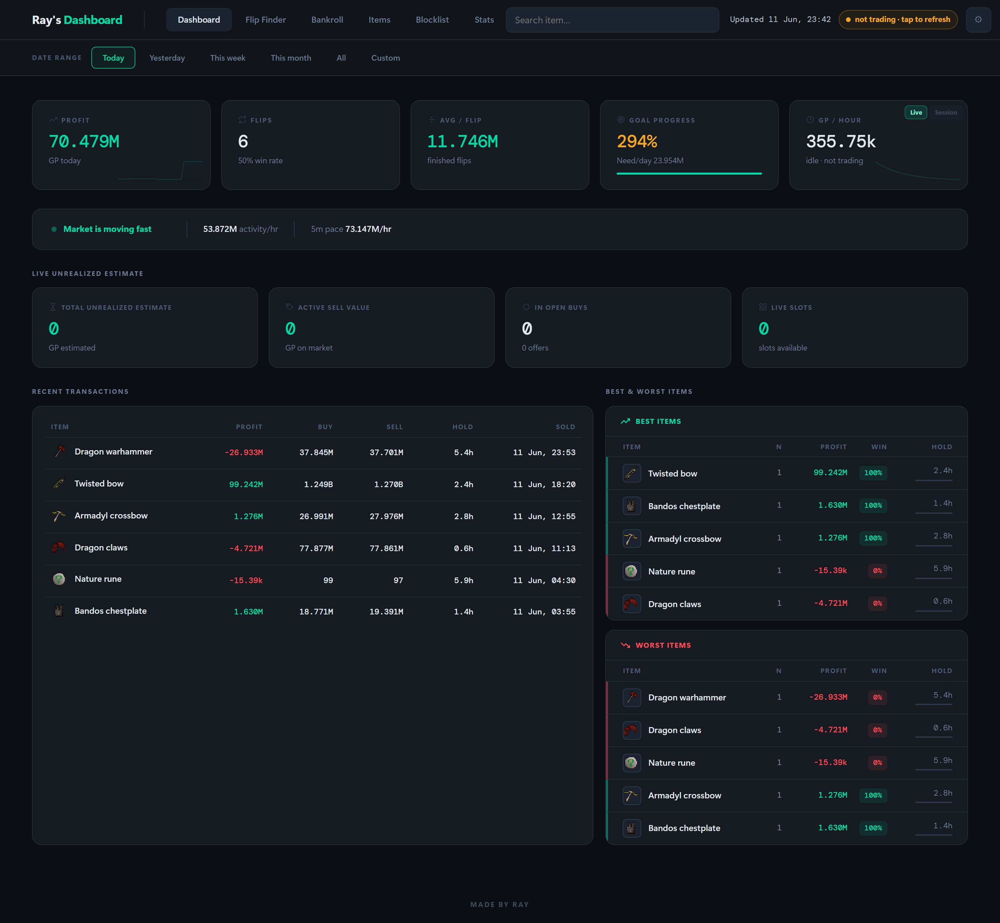
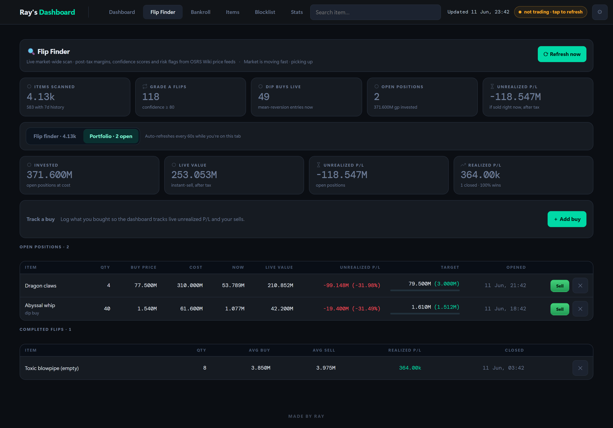
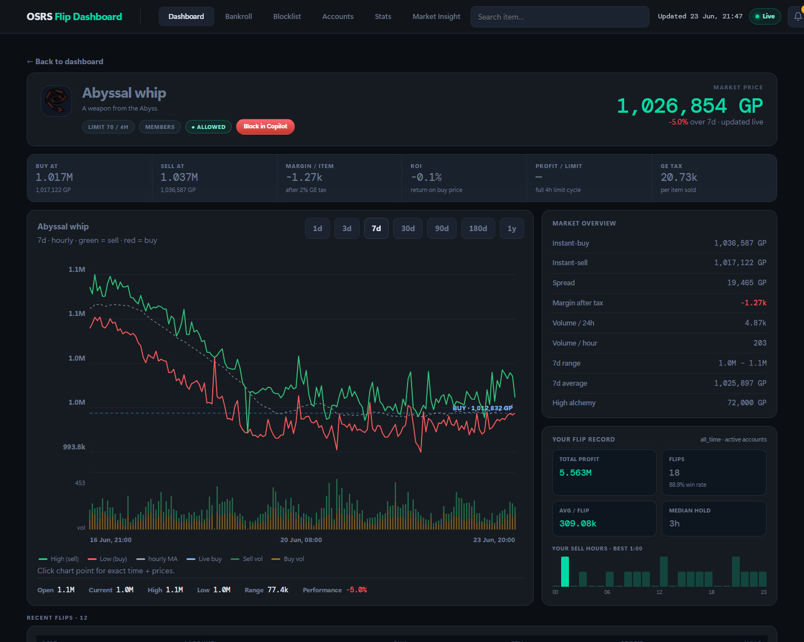
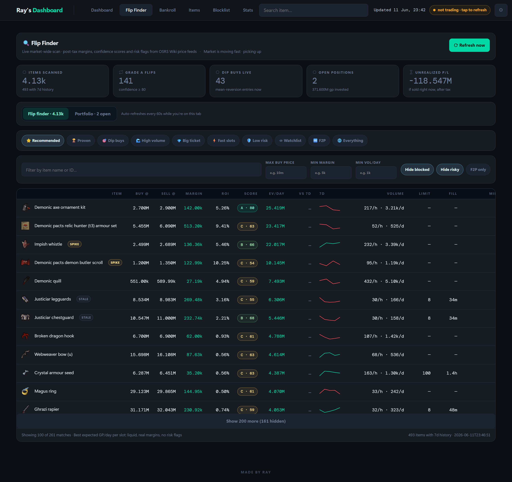

# OSRS Flip Dashboard

A local, self-hosted dashboard for Old School RuneScape Grand Exchange flipping. It syncs your flip history automatically from the [Flipping Copilot](https://flippingcopilot.com/) API and combines it with live [OSRS Wiki price data](https://prices.runescape.wiki/) — no extra accounts, no cloud, everything stays on your PC.

 — no dependencies, stdlib only.

## Screenshots

*Demo data — not real accounts.*

**Dashboard** — realized profit, GP/hour, goal pacing, recent transactions and best/worst items at a glance:



**Portfolio** — track buys and sells with live unrealized/realized P/L after tax:



**Item research page** — interactive price/volume chart, live margins, and your own flip record:



**Flip Finder** — market-wide scan ranked by expected GP/day, with z-score signals and 7-day sparklines:



## Features

- **Flip Finder** — live market-wide scan of ~4,000 items ranked by **expected GP/day per GE slot**, with post-tax margins, ROI, volumes, fill-time estimates, suggested buy/sell offers, and 0–100 confidence scores. Builds its own local 7-day price history to surface **mean-reversion signals** (dip-buy / falling-knife / overheated via z-score), risk flags (dumps, spikes, manipulation traps), and inline sparklines. Presets include Recommended (by EV), Proven (items you've flipped profitably before), Dip buys, High volume, Big ticket, Low risk, F2P and your Watchlist. Star items to get **dip and margin alerts** with browser notifications.
- **Portfolio** — track your buys and sells with live unrealized/realized P/L after GE tax, target prices, and a completed-flips history.
- **Dashboard** — realized profit from your Copilot flips by day/week/month, GP/hour, goal pacing, recent transactions, live unrealized estimate from your open offers — auto-synced from Copilot's API while you trade.
- **Bankroll** — per-account baselines, deposits/withdrawals, transfers, and net-worth tracking.
- **Item pages** — interactive price/volume charts, live margins, 7-day range/average, and your own flip record (profit, win rate, best sell hours) for any tradeable item.
- **Blocklist** — review and edit your Flipping Copilot item blocklist from the browser.
- **Stats** — all-time and per-period analytics: best items, hours, value tiers, slot efficiency.

## Setup

1. **Install Python 3.10+** (no other dependencies needed).
2. **Clone and run:**

   ```bash
   git clone https://github.com/Kenny427/raysdashboard
   cd raysdashboard
   python server.py
   ```

3. **Open** http://127.0.0.1:8791 in your browser.

That's it — live market data (Flip Finder, item pages, portfolio) works immediately.

### Your flip history (automatic)

The dashboard pulls your flip history straight from Flipping Copilot's API — no manual exports:

1. Log in to the **Flipping Copilot** RuneLite plugin at least once. This stores a login token on your PC (`~/.runelite/flipping-copilot/`), which the bundled sync script uses read-only.
2. That's all. The dashboard syncs automatically every minute while you're trading, and you can force a sync any time with the **live** pill in the header.

Your history is cached locally as `flips.csv` in the dashboard folder (gitignored — it never leaves your machine). If you'd rather not use the API sync, a manual plugin export (**Flip log → Export CSV**) to your `Documents`, `Downloads` or `Desktop` works as a fallback.

### Configuration (optional)

- Copy `bankroll_config.example.json` → `bankroll_config.json` to set your accounts, GP baselines and monthly goal (or just use the ⚙ settings in the UI — accounts are auto-detected from your CSV if you skip this).
- Copy `local_config.example.json` → `local_config.json` for machine-specific extras: a custom dashboard title, your Copilot blocklist profile name, and extra folders to search for CSV exports.

Both files are gitignored — your money data never leaves your machine.

### Optional: AI Market Insight

The **Market Insight** tab works out of the box with no setup — it ranks the day's
movers and trends with a deterministic, no-key engine. If you want it to also write
short natural-language summaries, you can plug in **your own** LLM API key (it's never
bundled, and the key stays server-side on your PC):

1. In the **Market Insight** tab, open its settings and paste a key, **or** add these
   keys to `local_config.json`:

   ```json
   {
     "insight_llm_provider": "openrouter",
     "insight_llm_model": "anthropic/claude-sonnet-4.5",
     "insight_llm_key": "your-api-key-here"
   }
   ```

   - `insight_llm_provider` — `openrouter` or `anthropic`.
   - `insight_llm_model` — e.g. `anthropic/claude-sonnet-4.5` for OpenRouter, or a
     model id like `claude-sonnet-4-5` for Anthropic direct. Leave blank for a sensible default.
   - Get a key from [OpenRouter](https://openrouter.ai/) or the
     [Anthropic Console](https://console.anthropic.com/).

2. Alternatively, set an `ANTHROPIC_API_KEY` environment variable and it's picked up automatically.

The key lives only in your gitignored `local_config.json` (or the environment) — it's
never committed and never sent anywhere except the provider you chose. Leave it unset
and the tab simply runs in its free, deterministic mode.

## Notes

- The server binds to `127.0.0.1` only; nothing is exposed to your network.
- Market data comes from the OSRS Wiki real-time prices API and is cached locally to keep request volume polite.
- On Windows you can use `start_dashboard.bat` to launch it (it won't start a second copy if one is already running).
